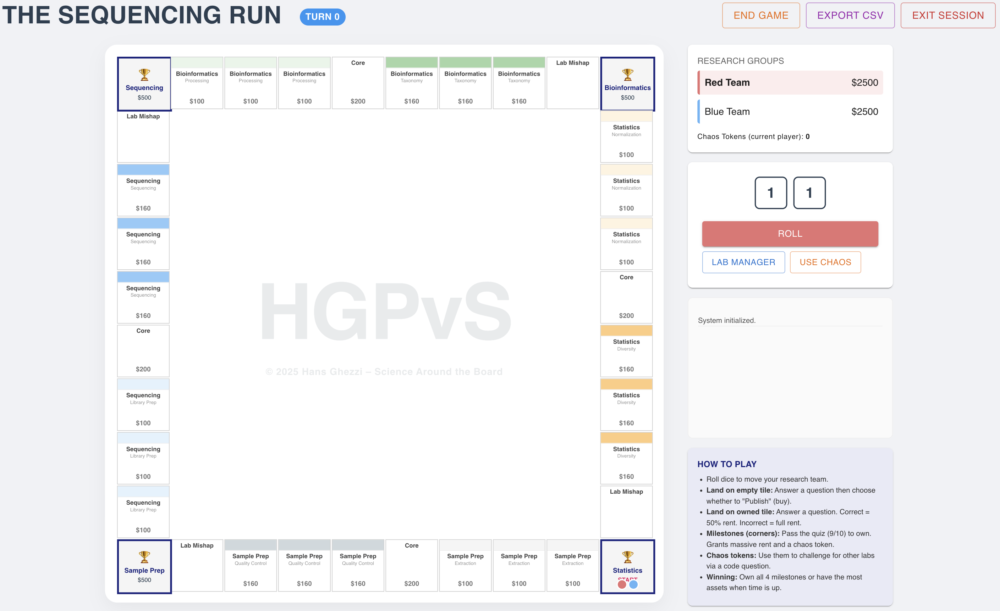

# Science Around the Board

A pedagogical game to incentivise learning across all disciplines. 

  

## ⚽️ Game:
Play [HERE](https://hghezzi.github.io/Science-Around-the-Board/)

*NOTE*: Science Around the Board is currently NOT supported on mobiles.

## 🛠️ Instructor Tools:
* **[Password Encryptor Tool](https://hghezzi.github.io/Science-Around-the-Board/encryptor.html)** – Use this to create encrypted question files to share with your students.

## Requirements:
* A **computer** to run the game
* **Internet connection** to access the game on github, although a stable connection is not required once you start a gaming session.
* A **TSV question file** (e.g. 'questions.tsv' in the 'public' folder of this repo)
  * The game dynamically parses question files to find all tile informations, meaning that the input file should closely fit the structure described below.
 
## Question file:
While I designed 'Science Around the Board' with Bioinformatics in mind, it is structured so that users can play with absolutely **any** topic, challenge level, language, etc... (yes, I have turned this into an evening board night with my fiancée to test her knowldge of RuPaul's Drag Race). This is achieved through a dynamic parsing of the TSV question file loaded at the beginning of each session. For this reason, each file should closely match this structure:

* **id**: A unique string (e.g., topic_01).
* **question**: The question text (clear, concise).
* **option1**: Possible answer number 1
* **option2**: Possible answer number 2
* **option3**: Possible answer number 3
* **option4**: Possible answer number 4
* **correctIndex**: A number (1, 2, 3, 4) based on which of the 4 options above is the correct answer.
* **explanation**: A brief one sentence statement explaining the correct answer for the question
* **bigTopic**: The main subject (e.g., 'Genomics'). Questions that can appear in multiple 'bigTopic' can be written in the same row as a comma-separated list (e.g. 'Genomics, Metagenomics, 16S')
* **module**: The specific topic within the main subject (e.g., 'Week 2'). This is a subtopic of ‘bigTopic’.
* **theme**: 4 different themes must be provided for each module, corresponding to each of the 4 sides of the board (e.g. Sample Prep). This is a subtopic of ‘module’, meaning that each 'module' should have 4 unique themes.
* **subtheme**: 2 subthemes  must be provided for each ‘theme’ (e.g. 'Quality Control' and 'Sample Prep').
* **type**: One of the following options: property, core, milestone, pre, post, confidence. Each option corresponds to a tile type in the game (property, core, milestone) or the pre-survey, post-survey, and confidence sliders. You must provide at least one question for each tile in the game.
* **imageFile**: Name of image, including its extension, used in the question of this row. The same image can be used in multiple questions and must be uploaded at the beginning of the game.

To ensure diversity in the questions asked to different players, I always design >10 questions for each subtheme.

I also provided an example file (FORMAT_INSTRUCTIONS.txt) in this repo with the instructions I provided to Gemini Gems to create questions. I use Gems as it allows to edit the knowledge source and instructions, meaning I could directly use Canvas content, lesson notes, and more for questions generation.

Quesiton file contains the right answers and must be shared with students, which is why I also created the encryptor tool above. 

## License
This project is licensed under a **Creative Commons Attribution-NonCommercial-ShareAlike 4.0 International License**.

You are free to use, modify, and distribute this software for **educational and non-commercial purposes**, provided you attribute the original author (Hans Ghezzi).

**Commercial use is strictly prohibited** without prior written permission. If you wish to use this software for commercial purposes, please contact me.

