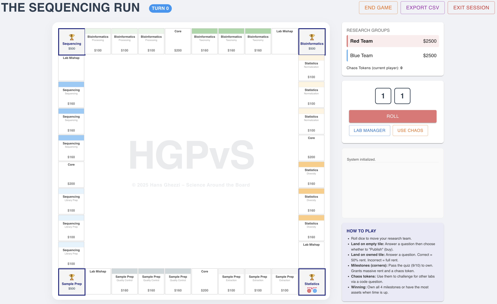

# Science Around the Board

A customizable, open-source board game engine for education.

  

🎮 **[Play the Game](https://hghezzi.github.io/Science-Around-the-Board/)**
📚 **[Read the Instructor Manual](https://hghezzi.github.io/Science-Around-the-Board/SAB_Instructor_Manual.pdf)**

## 🛠️ Instructor Tools:
* **[Password Encryptor Tool](https://hghezzi.github.io/Science-Around-the-Board/encryptor.html)** – Use this to create encrypted question files to share with your students.

## Requirements:
* A **computer** to run the game
* **Internet connection** to access the game on github, although a stable connection is not required once you start a gaming session.
* A **TSV question file** (or simply start with the demo option to test the gameplay!)
  
## License
This project is licensed under a **Creative Commons Attribution-NonCommercial-ShareAlike 4.0 International License**.

You are free to use, modify, and distribute this software for **educational and non-commercial purposes**, provided you attribute the original author (Hans Ghezzi).

**Commercial use is strictly prohibited** without prior written permission. If you wish to use this software for commercial purposes, please contact me.

