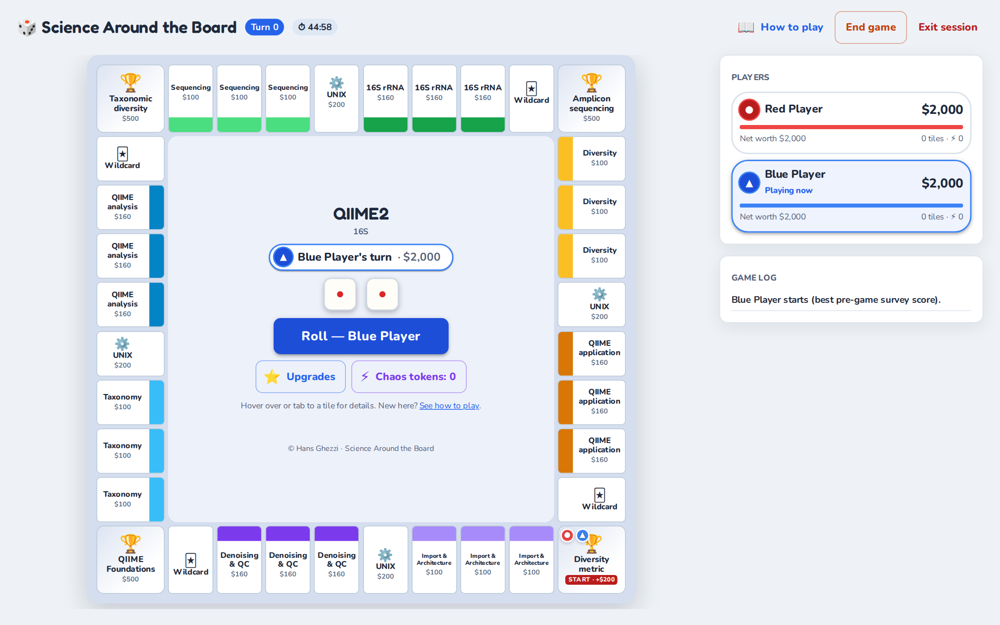

# Science Around the Board

**A free, open-source board game that turns any course's review session into active learning.** Teams of students roll dice, answer *your* questions to buy, defend and upgrade tiles, capture corner exams and steal rival tiles. An explanation follows every answer, and a pre- and post-game survey shows what each team learned. It runs in the browser, with no installation, accounts or server, and it works for any subject.

<p align="center">
  
</p>

<p align="center">
  <a href="https://hghezzi.github.io/Science-Around-the-Board/"><b>▶ Play now</b></a> ·
  <a href="https://hghezzi.github.io/Science-Around-the-Board/guide/">Instructor Guide</a> (<a href="https://hghezzi.github.io/Science-Around-the-Board/SAB_Instructor_Guide.pdf">PDF</a>) ·
  <a href="https://hghezzi.github.io/Science-Around-the-Board/guide/students.html">Student Guide</a> (<a href="https://hghezzi.github.io/Science-Around-the-Board/SAB_Student_Guide.pdf">PDF</a>)
</p>

Science Around the Board (SAB) was created by Hans Ghezzi for a fourth-year microbiology course at the University of British Columbia (16S rRNA sequencing with QIIME 2). It has since been used for genomics workshops and even a trivia night. The game itself uses no subject vocabulary: everything subject-specific comes from one spreadsheet that you write.

## Try it in two minutes

Open the [game](https://hghezzi.github.io/Science-Around-the-Board/) and click **Play the demo** (16S rRNA sequencing) or **Try a different subject** (Intro Statistics). Choose **Solo**, a topic and **Start game →**.

## Run it with your class

1. **Write your questions** in a spreadsheet: start from the [Intro Statistics example](https://hghezzi.github.io/Science-Around-the-Board/examples/intro_statistics.tsv), or let Claude draft them with the [question-writer skill](#generate-questions-with-claude).
2. **Load the file in the game.** The built-in checker lists anything that needs fixing.
3. **Share it with students:** as one game link (for example to a published Google Sheet), or as a file, which you can password-protect.
4. **Play.** Up to four teams share each computer. A typical session takes 45–90 minutes, and an optional timer ends the game on time.
5. **Collect results.** Students send them straight to your own Google Sheet, email them to you or download a CSV file for your course page.

The [Instructor Guide](https://hghezzi.github.io/Science-Around-the-Board/guide/) walks through each step, starting with a [Quick start](https://hghezzi.github.io/Science-Around-the-Board/guide/#quick-start). It also covers the pedagogy behind the game (playful pedagogy, Bloom's taxonomy, backward design and a BOPPPS lesson plan) and how to analyse the results. Give students the [Student Guide](https://hghezzi.github.io/Science-Around-the-Board/guide/students.html): it explains the rules in five minutes.

## What's in the box

- **Your questions, any subject.** Multiple choice, true/false, select all that apply, numeric (with tolerance), ordering and short answer. Questions can include images.
- **Learning built into the rules:**
  - recall questions on the property tiles;
  - harder 6-question exams on the corner milestones;
  - your explanation shown after every answer, right or wrong.
- **Measurement:** confidence sliders and a knowledge check before and after the game. The CSV export records every answer and transaction.
- **Results delivery:** an optional [Google Apps Script collector](public/tools/sab-results-collector.gs) puts every team's results in your own Google Sheet. Email and CSV download are the alternatives. You set this up with a few `config` rows in the question file.
- **Game links:** share one link and your questions load by themselves, from a published Google Sheet, a GitHub file or any public link. Build the link on the start page ("For instructors: share your questions as a link").
- **[Password-protected files](https://hghezzi.github.io/Science-Around-the-Board/encryptor.html):** encrypt your question file so students can't read the answers before playing.
- **A file checker:** loading a file lists missing columns, wrong answer keys, missing themes and similar problems in plain language.
- **Classroom-proof:**
  - autosave, so an accidental refresh offers *Resume your game?*;
  - works offline after the first visit, and can be installed as an app;
  - light and dark mode, and team symbols (●▲■◆) as well as colours.

## The question file at a glance

One row per question, in a spreadsheet saved as tab-separated values (`.tsv`):

| Column | What it holds |
| :--- | :--- |
| `id`, `question`, `explanation` | A unique id, the prompt, and the feedback shown after answering |
| `option1`–`option4`, `correctIndex` | The answer choices and the number of the right one (`1,3` for select-all) |
| `type` | `property`, `milestone`, `core`, `mishap` (Wildcard events), `survey`, `confidence` or `config` |
| `bigTopic`, `module` | The topic and module players pick at setup |
| `theme`, `subtheme` | The first 4 themes become the board's 4 sides, each with 2 subtheme groups of tiles |
| `imageFile`, `format`, `answer`, `tolerance` | Optional: an image, and the settings for other question formats |

Details are in [Designing the input file](https://hghezzi.github.io/Science-Around-the-Board/guide/#designing-the-input-file) (Instructor Guide) and in the [complete format reference](.claude/skills/sab-question-writer/references/format.md).

## Generate questions with Claude

The [`sab-question-writer`](.claude/skills/sab-question-writer/) skill works with you, step by step:

1. It interviews you about your course and learning objectives, and reads any notes or slides you share.
2. It proposes a board layout for your approval.
3. It writes the questions, with distractors based on common misconceptions and a teaching explanation for each.
4. It checks the file and hands it over, ready to load.

To use it:

- **In Claude.ai:** download the [skill zip](https://hghezzi.github.io/Science-Around-the-Board/downloads/sab-question-writer.zip) and add it in Claude's skills settings. Then ask, for example: *"Make a Science Around the Board game reviewing cellular respiration for first-year biology."*
- **In Claude Code:** open this repository; the skill loads automatically.

Always review generated questions before class.

## Privacy

The game runs entirely in the browser. Question files, answers and surveys stay on the players' computer unless students click **Send results to instructor** (which sends them to the instructor's own Google Sheet) or hand in the results file themselves. Usage analytics (Google Analytics, which sets cookies) load only if a visitor opts in. See the [privacy notice](https://hghezzi.github.io/Science-Around-the-Board/privacy.html).

## Requirements

- A laptop or desktop computer (or a tablet in landscape) with a current browser: Chrome, Edge, Firefox or Safari. The board needs a window at least about 600 pixels wide, so phones are not supported.
- An internet connection for the first visit and for game links. After the first visit, the game works offline.

## For developers

SAB is a React 19 + Vite single-page app with no backend, hosted on GitHub Pages. You need Node.js 20.19 or later (CI uses Node 22).

```bash
npm install
npm run dev        # local dev server
npm test           # unit tests (Vitest)
npm run lint       # ESLint
npm run build      # production build in dist/
npm run validate-tsv -- my_questions.tsv   # check a question file
```

- `npm run smoke`: an end-to-end test (Playwright). It plays the demo with 1 to 4 teams and in dark mode, and checks the exported results, a mocked Google Sheet send, `.lock` files and links, resume after a refresh, and offline use. Run it before every deploy.
- `npm run privacy`: checks that nothing loads before analytics opt-in, that unsafe share links are refused and that the Content-Security-Policy blocks nothing.
- `npm run a11y`: accessibility checks (axe-core) on the main screens in light and dark mode. Run it against `npm run preview`.
- `npm run guide`: rebuilds both guides from [`guide/`](guide/): fresh screenshots, web pages and PDFs. It needs Playwright's Chromium.
- `npm run deploy`: publishes `dist/` to GitHub Pages.

CI runs lint, tests, both question-file validators and the build on every pull request. [CLAUDE.md](CLAUDE.md) maps the architecture and lists the project conventions.

| Folder | What's in it |
| :--- | :--- |
| `src/` | The app. Game rules, the file parser, the board builder and the file checker are plain JavaScript modules with unit tests in `tests/`. |
| `public/` | Files served with the app: the example question files, hosted images, the encryptor, the privacy notice, the results collector and the built guides. |
| `guide/` | The Markdown sources and screenshots of the Instructor and Student Guides. |
| `scripts/` | The file validator CLI, the guide and skill builders, the icon generator, and the smoke and accessibility tests. |
| `.claude/skills/sab-question-writer/` | The question-writer skill for Claude, with the format reference and a Python validator. |

**Contributing.** Bug reports, ideas and pull requests are welcome. Please keep the game's own wording subject-neutral (game terms live in `src/labels.js`), add tests for rule changes, and update the guides for anything players or instructors will notice. Changes to gameplay, scoring or the results file affect classes using the live site, so please describe them in the pull request. See [CONTRIBUTING.md](CONTRIBUTING.md), and report security problems privately as described in [SECURITY.md](SECURITY.md).

## Documentation

| Document | Read it on the web | Source |
| :--- | :--- | :--- |
| Instructor Guide | [Web](https://hghezzi.github.io/Science-Around-the-Board/guide/) · [PDF](https://hghezzi.github.io/Science-Around-the-Board/SAB_Instructor_Guide.pdf) | [`guide/instructor-guide.md`](guide/instructor-guide.md) |
| Student Guide | [Web](https://hghezzi.github.io/Science-Around-the-Board/guide/students.html) · [PDF](https://hghezzi.github.io/Science-Around-the-Board/SAB_Student_Guide.pdf) | [`guide/student-guide.md`](guide/student-guide.md) |
| Question file format | | [`format.md`](.claude/skills/sab-question-writer/references/format.md) |
| Architecture and conventions | | [`CLAUDE.md`](CLAUDE.md) |

The March 2026 edition of the Instructor Guide is [archived as a PDF](public/archive/SAB_Instructor_Guide_2026-03.pdf).

Found a bug or have an idea? [Open an issue](https://github.com/hghezzi/Science-Around-the-Board/issues).

## Citing

If you use Science Around the Board in teaching or research, please cite it as (see also [`CITATION.cff`](CITATION.cff)):

> Ghezzi, H. (2026). *Science Around the Board* [Computer software]. https://github.com/hghezzi/Science-Around-the-Board

## License

© Hans Ghezzi. Licensed under a [Creative Commons Attribution-NonCommercial-ShareAlike 4.0 International License](https://creativecommons.org/licenses/by-nc-sa/4.0/) (see [LICENSE](LICENSE)).

You are free to use, adapt and share Science Around the Board for **educational and other non-commercial purposes**. You must credit the original author (Hans Ghezzi) and share any adaptations under the same license. **Commercial use requires prior written permission** from the author; contact Hans Ghezzi through [GitHub](https://github.com/hghezzi).

[](https://creativecommons.org/licenses/by-nc-sa/4.0/)
