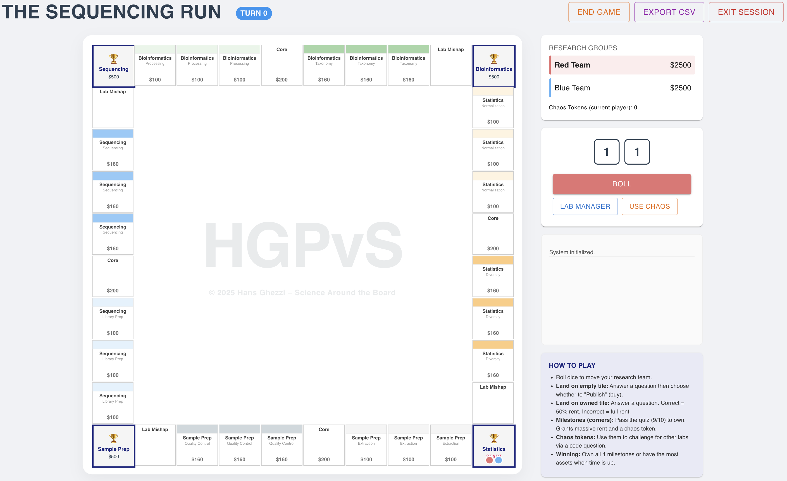

# Science Around the Board

A customizable, open-source board game engine for education.

  

🎮 **[Play the Game](https://hghezzi.github.io/Science-Around-the-Board/)**
📚 **Instructor Guide:** [web](https://hghezzi.github.io/Science-Around-the-Board/guide/) · [PDF](https://hghezzi.github.io/Science-Around-the-Board/SAB_Instructor_Guide.pdf). It is rebuilt from [`guide/instructor-guide.md`](guide/instructor-guide.md) whenever the game changes. The March 2026 edition is [archived here](public/archive/SAB_Instructor_Guide_2026-03.pdf).

Student teams roll dice around a 36-tile board and answer **your** questions to buy, defend and upgrade tiles, capture milestone exams and steal rival properties. A pre- and post-game survey measures learning, and every answer is recorded for grading and analysis: students can send the results straight to your Google Sheet, email them or download a CSV. Everything is driven by one spreadsheet (TSV) file, so it works for any subject. Try the built-in 16S/QIIME2 demo, or the Intro Statistics example.

## 🛠️ Instructor Tools
* **Game links**: share one link and your questions load by themselves, from a published Google Sheet, a GitHub file or any public link. Build it on the start page ("For instructors: share your questions as a link").
* **Results collection**: an optional [Google Apps Script](public/tools/sab-results-collector.gs) puts every team's results in your own Google Sheet when students click "Send results to instructor". An email button and a CSV download are the fallbacks. Set it up with `config` rows in the question file (see the Instructor Guide).
* **[Password Encryptor Tool](https://hghezzi.github.io/Science-Around-the-Board/encryptor.html)**: create encrypted question files to share with your students.
* **Question checker**: when you load a file, the game lists any problems, such as missing columns, a wrong `correctIndex` or fewer than 4 themes. Developers can also run `npm run validate-tsv -- my_questions.tsv`.
* **✨ Generate questions with Claude**: the [`sab-question-writer`](.claude/skills/sab-question-writer/) skill interviews you about your course and learning objectives, researches the topic, proposes a board layout, then writes a complete, validated question file (with optional figures).
  * **Claude.ai:** download the [skill zip](https://hghezzi.github.io/Science-Around-the-Board/downloads/sab-question-writer.zip) and upload it in Claude's skills settings. Then ask, for example: *"Make a Science Around the Board game reviewing cellular respiration for first-year biology."*
  * **Claude Code:** open this repository; the skill loads automatically.

## Question file at a glance
One row per question. The columns are `id, question, option1–option4, correctIndex, explanation, bigTopic, module, theme, subtheme, type, imageFile`, plus the optional `format, answer, tolerance`.

* **`type`**: `property`, `milestone`, `core`, `mishap`, `survey` or `confidence`, plus optional `config` rows for instructor settings (results link, email, course name).
* **`format`**: multiple choice (default), true/false (2 options), `multi` (select all that apply), `numeric` (with tolerance), `order` (put steps in order) or `text` (short answer, accepting alternatives).
* The first 4 `theme`s become the 4 board sides, each with 2 `subtheme` groups.
* Full specification: [Technical Guide](website/docs/instructor/technical-guide.md) and [format reference](.claude/skills/sab-question-writer/references/format.md).

## How a game ends
* **Last team standing.** A bankrupt team gets one Rescue Quiz; if it fails, or goes bankrupt again, it is eliminated.
* **Time's up / End Game.** The highest net worth (cash + property value) wins. Set an optional session timer on the setup screen.

## Requirements
* A **computer** with a modern browser. Nothing to install, although Chrome and Edge can install it as an app. Light and dark mode are both supported.
* An **internet connection** for the first visit. After that the game works offline, and an accidental refresh offers to resume the session.
* A **TSV question file**, or start with one of the built-in examples.

## Privacy
The game runs entirely in the browser: question files, answers and surveys stay on the players' computer, unless students click "Send results to instructor" (they go to the instructor's own Google Sheet) or submit the results file themselves. Anonymous usage analytics (Google Analytics) load **only if a visitor opts in**. See the [privacy notice](https://hghezzi.github.io/Science-Around-the-Board/privacy.html).

## For developers
React + Vite single-page app with no backend. `npm install`, then `npm run dev`. Before pushing, run `npm test`, `npm run lint` and `npm run build`; CI runs the same checks.
* `npm run smoke`: end-to-end test (Playwright): plays the demo with 1–4 teams and in dark mode, checks the exported results, a mocked Google Sheet send, `.lock` uploads and links, resume after a refresh, and offline use. Run it before every deploy.
* `npm run a11y`: accessibility checks (axe-core) on the main screens in light and dark mode, against `npm run preview`.
* `npm run guide`: rebuilds the Instructor Guide (fresh screenshots, web page and PDF). It needs Playwright's Chromium.
* `npm run deploy`: deploys to GitHub Pages. See [CLAUDE.md](CLAUDE.md) for an architecture overview.

## License
This project is licensed under a **Creative Commons Attribution-NonCommercial-ShareAlike 4.0 International License**.

You are free to use, modify, and distribute this software for **educational and non-commercial purposes**, provided you attribute the original author (Hans Ghezzi).

**Commercial use is strictly prohibited** without prior written permission. If you wish to use this software for commercial purposes, please contact me.

