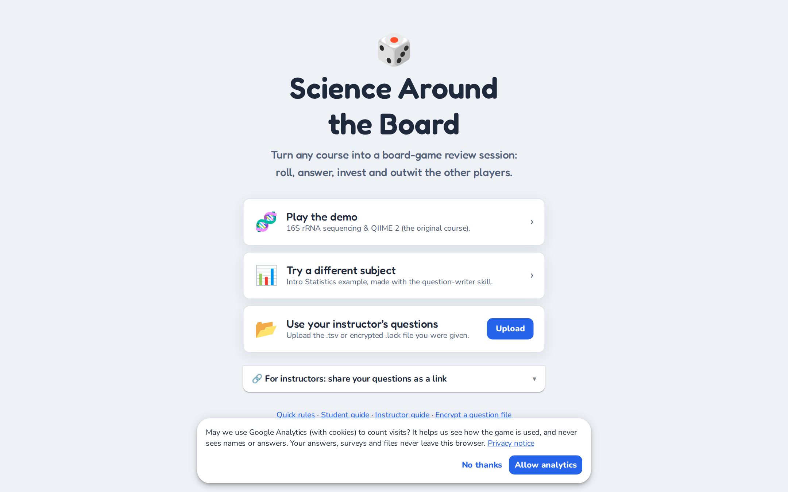
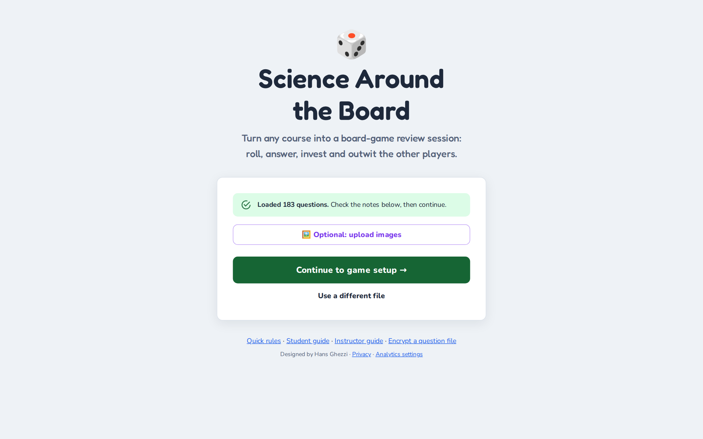
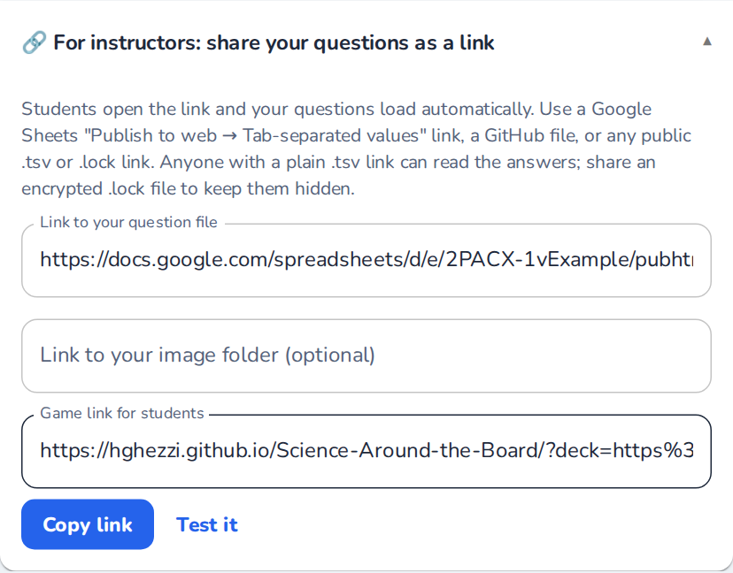
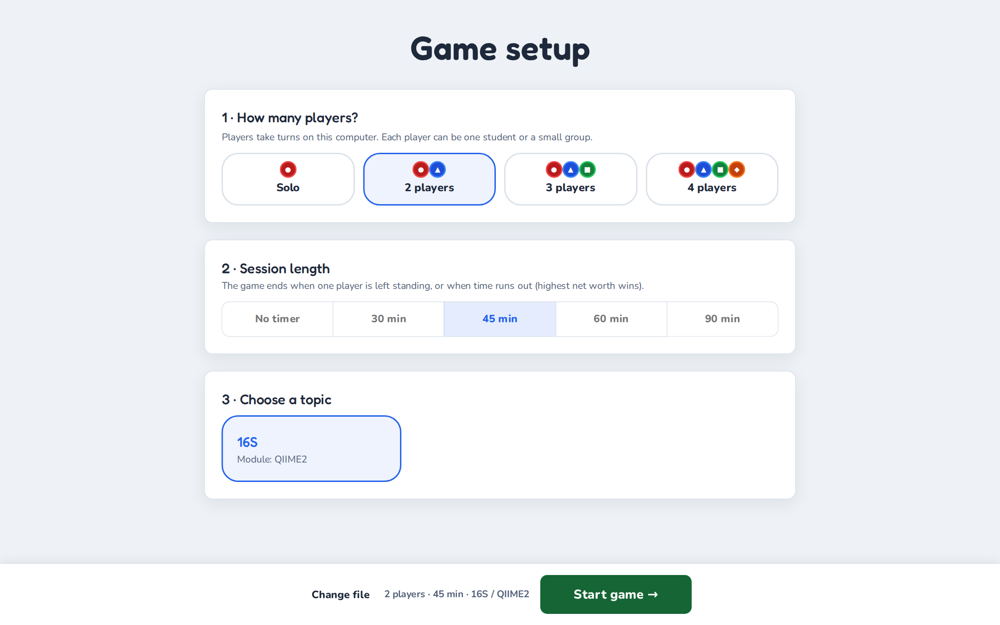
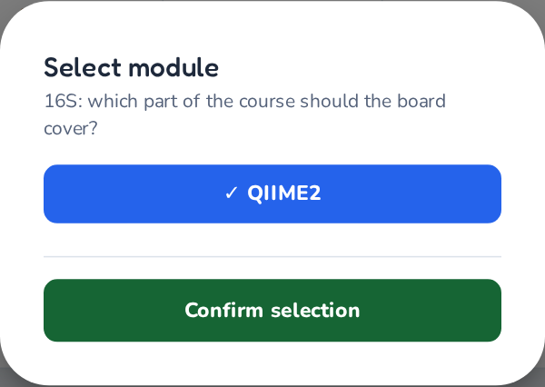
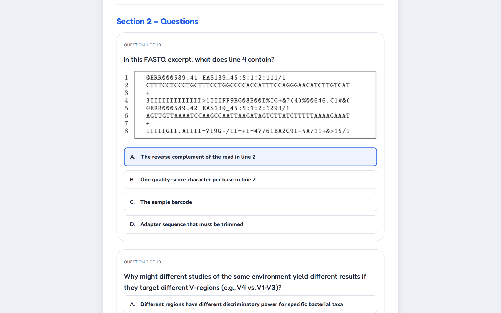
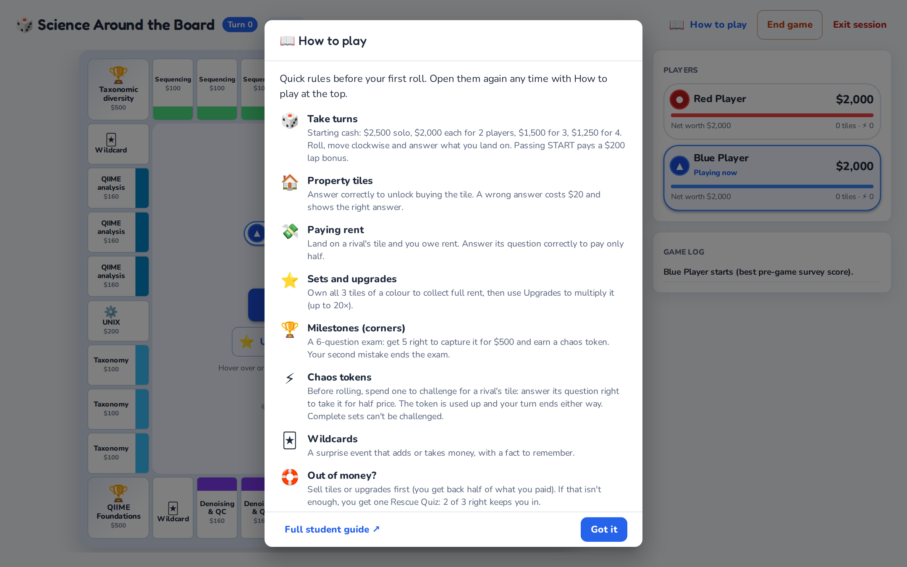
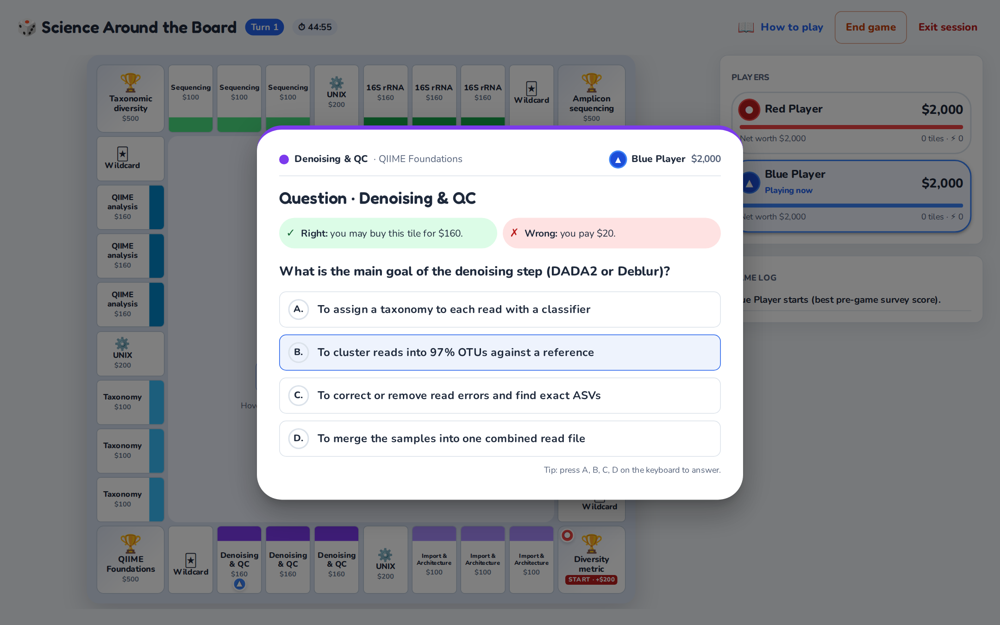
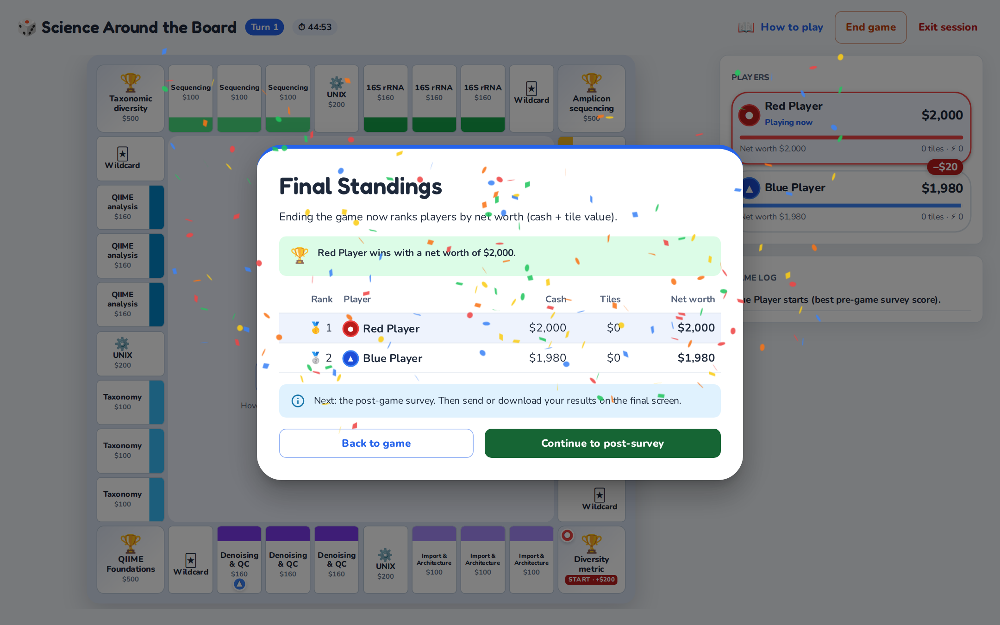

# Instructor Guide to ‘Science Around the Board’

**By Hans Ghezzi** · *Living edition, last updated October 2026*

> This guide lives in the project repository and is rebuilt every time the game changes, so it always matches the version at <https://hghezzi.github.io/Science-Around-the-Board/>. Read it on the [web](https://hghezzi.github.io/Science-Around-the-Board/guide/) or as a [PDF](https://hghezzi.github.io/Science-Around-the-Board/SAB_Instructor_Guide.pdf). For your students, there is a short [Student Guide](student-guide.md) ([web](https://hghezzi.github.io/Science-Around-the-Board/guide/students.html) · [printable PDF](https://hghezzi.github.io/Science-Around-the-Board/SAB_Student_Guide.pdf)).
>
> **New here?** Start with the [Quick start](#quick-start). **Used it before?** See [What’s new](#whats-new).

<!-- toc -->

## Quick start

You can try the game in five minutes and run your first class with your own questions the same week. It is free. You need a browser and, for your own questions, a spreadsheet; you don't need to install anything, create an account, use GitHub or set up a server.

1. **Play the demo (5 minutes).** Open <https://hghezzi.github.io/Science-Around-the-Board/> and click **Play the demo** (16S rRNA sequencing) or **Try a different subject** (Intro Statistics). Continue to the setup, choose **Solo**, a topic and **Start game →**, then answer the survey and roll a few times. Click **End game** to see the end of a session.
2. **Make your question file.** Pick one of two routes:
   - **Do it yourself:** save the [Intro Statistics example](https://hghezzi.github.io/Science-Around-the-Board/examples/intro_statistics.tsv) to your computer (right-click the link, then **Save link as…**) and open it in Google Sheets (**File → Import → Upload**). Keep the header row and replace the rows with your own questions. [Designing the input file](#designing-the-input-file) explains every column.
   - **Let Claude draft it:** the [question-writer skill](#generating-questions-with-claude-optional) interviews you about your course and writes a complete, checked file for you to review.
3. **Check it.** Download it as **Tab-separated values (.tsv)** (in Google Sheets: **File → Download**), load it in the game with **Upload** and read the [file check](#checking-your-file). Fix every red item.
4. **Decide how students get the questions:** a game link to a published Google Sheet, or the file itself, optionally password-protected. See [Sharing the game with students](#sharing-the-game-with-students).
5. **Decide how results reach you.** By default, students download a results file and submit it on your course page. With one or two extra rows in the file, they can email it to you or send it straight to your own Google Sheet instead. See [Collecting results](#collecting-results).
6. **In class:** seat groups of 2–4 students; each group plays as one player, and up to four players can share a computer. Give students the link (or file) and the [Student Guide](student-guide.md), and tell them which session length and module to pick. A suggested 80-minute plan is in [Structuring your time](#structuring-your-time-the-boppps-model).

**Before class:** play your own file once, with a 2-player game, from start to results screen, on the kind of computer students will use. It takes about 10 minutes and catches almost every problem.

## Introduction

Educational practices are constantly evolving, moving away from passive absorption towards active engagement. Growing up in a memorization-heavy system, I experienced firsthand the limitations of rote learning and the powerful impact that active, student-centered strategies can have on both motivation and long-term retention. As instructors, our primary goal is to support such deeper learning, but we should not view this as a strictly rigid or purely serious process.

This is where the potential of playful pedagogy becomes transformative. By integrating game mechanics such as competition, resource management, and immediate feedback into the curriculum, we can create a dynamic environment where students feel safe to fail and eager to try again. The game I developed, Science Around the Board, leverages these principles to turn reviewing into an engaging learning cycle. This manual will guide you through that transition, showing you how to align the dynamic energy of a board game with the rigorous learning objectives of your course.

## Definitions

### What is playful pedagogy?

Playful pedagogy is an instructional approach that integrates the structures and spirit of play (curiosity, experimentation and social interaction) into the learning process. In this model, teachers become facilitators rather than remaining the center of the classroom. This shift establishes a "safe space" where students can take risks, make mistakes, and learn iteratively without the immediate anxiety of grade penalties.

### What is Science Around the Board?

Science Around the Board is a customizable, web-based, open-source educational platform developed to gamify the learning of complex topics.

- **Setup:** instructors provide a question file in tab-separated values (.tsv) format, plus optional images. One to four players share a computer and load the file, or simply open a game link the instructor shares.
- **Pre-game survey:** before starting, each player completes a short pre-assessment.
- **Moving around the board:** players take turns rolling a pair of dice and moving around a square board. Each side of the board is dedicated to one theme.
  - **Unowned tile:** the player answers one of your questions for the option to buy it.
  - **Rival's tile:** the player pays rent, and a correct answer halves it.
  - **Corner milestones:** the player must pass a short exam to capture the corner, which earns a Chaos Token. Chaos Tokens can be spent to try to steal a rival's property.
  - **Full colour group:** a player who owns every tile of a colour can add stars to charge much higher rent.
- **The end:** the game ends when only one player is left standing, or when time runs out, in which case the player with the highest net worth wins.
- **Post-game survey:** afterwards, players answer the same survey again, so instructors can track learning.

The game leverages key pedagogical frameworks, such as the BOPPPS model of lesson design, along with active learning techniques and frequent low-stakes assessments to incentivize and scaffold learning. Instructors should include explanations with each question to provide frequent learning opportunities.

While originally designed for a 4th-year undergraduate research course in Microbiology, the modular nature of the game engine works seamlessly with absolutely any topic, as the content is determined by the input file. Its versatility is limitless: I have used the exact same engine to run advanced genomics workshops and to host a RuPaul’s Drag Race trivia night with my wife! The built-in *Intro Statistics* example shows the same engine with a completely different subject.

## Why use ‘Science Around the Board’?

Successfully leveraging play in the classroom requires aligning activities with the learning objectives. Misalignment, requiring effort allocation towards tasks that do not move students forward in the learning process, can be counterproductive by decreasing motivation and attention. It is critical to be intentional, ensuring games align with Learning Outcomes (LOs), and that the fun does not distract from the learning. A useful strategy when brainstorming playful frameworks is to begin thinking about which verb to address in Bloom’s Taxonomy.

In my experience as an instructor, TA, and facilitator I recognised that students often struggle to conceptualise complex class material, frequently performing tasks without understanding the theory behind it. Students frequently “do” tasks without “knowing”, thus the playful activity I had envisioned had to address the Bloom’s verb “understand”, which involves gaining more knowledge through review and practice. Science Around the Board was built to bridge this gap: it enables students to step back from the rote execution of tasks and confront the conceptual framework that supports them. SAB is suited to test the ability of students to recall and recontextualise class material in novel applications.

Science Around the Board is best suited as a replacement for review sessions, with successful execution and student feedback for both individual or group use, and synchronously or asynchronously. Instructors can design questions spanning any range of topics and use matching pre- and post-assessments to track students' learning throughout the game. Additionally, Science Around the Board incorporates numerous opportunities for iterative assessment followed by scaffolded explanations, enabling learning opportunities at every stage while removing the fear of failure.

### The “data sandwich”: how a session measures learning

Every session wraps the game in measurement, so you learn something about your class each time:

1. **Pre-game survey (baseline).** Each player rates its confidence on your learning objectives (0–10 sliders) and answers 10 knowledge questions drawn at random from your `survey` rows.
2. **Gameplay (the intervention).** Dozens of low-stakes questions, each followed straight away by your explanation. Getting a question wrong costs only in-game money, so mistakes are cheap and memorable.
3. **Post-game survey (growth).** The same sliders and the same 10 questions again. The end screen shows each player’s score before and after.
4. **Results file (the record).** Every answer, transaction and survey response, ready for a spreadsheet. See [What the results contain](#what-the-results-contain).

Comparing confidence with survey scores also shows calibration: a player who rates their confidence 9/10 but scores 4/10 has a misconception worth addressing, and one that does the reverse may need encouragement.

### Which mechanics exercise which skills

| Game mechanic | Bloom’s level | Why |
| :--- | :--- | :--- |
| Property questions and rent defense | Remember, understand | Quick retrieval of facts and concepts, many times per session |
| Milestone exams | Apply, analyze | Six harder questions in a row on one theme, with little room for error |
| Image questions | Apply | Interpreting a plot, a gel or a code snippet rather than recalling a fact |
| Upgrades | Analyze (the strategy) | Deciding whether to invest or keep cash means weighing risk |
| Chaos challenges | Evaluate (metacognition) | A player must judge whether it knows a rival’s topic well enough to bet on it |

## Important links

| What | Link |
| :--- | :--- |
| Game | <https://hghezzi.github.io/Science-Around-the-Board/> |
| This guide (web / PDF) | [Web version](https://hghezzi.github.io/Science-Around-the-Board/guide/) · [PDF](https://hghezzi.github.io/Science-Around-the-Board/SAB_Instructor_Guide.pdf) |
| Student Guide (web / PDF) | [Web version](https://hghezzi.github.io/Science-Around-the-Board/guide/students.html) · [PDF](https://hghezzi.github.io/Science-Around-the-Board/SAB_Student_Guide.pdf) |
| Example files to start from | [Intro Statistics (.tsv)](https://hghezzi.github.io/Science-Around-the-Board/examples/intro_statistics.tsv) · [16S demo (.tsv)](https://hghezzi.github.io/Science-Around-the-Board/SAB_questions_Jan22_Filtered.tsv) |
| Complete file format reference | [format.md on GitHub](https://github.com/hghezzi/Science-Around-the-Board/blob/main/.claude/skills/sab-question-writer/references/format.md) |
| Encryption tool | <https://hghezzi.github.io/Science-Around-the-Board/encryptor.html> |
| Question-writer skill for Claude | [Download (.zip)](https://hghezzi.github.io/Science-Around-the-Board/downloads/sab-question-writer.zip) |
| Results collector for Google Sheets | [Apps Script code](https://hghezzi.github.io/Science-Around-the-Board/tools/sab-results-collector.gs) (see [Collecting results](#collecting-results)) |
| Privacy notice | <https://hghezzi.github.io/Science-Around-the-Board/privacy.html> |
| Source code, questions and bug reports | [GitHub repository](https://github.com/hghezzi/Science-Around-the-Board) · [Issues](https://github.com/hghezzi/Science-Around-the-Board/issues) |

## How to use ‘Science Around the Board’

### Choosing a topic

This is probably the most straightforward portion of the guide. While Science Around the Board was designed for a microbiology course, instructors can use the game engine for absolutely any topic. Pick a subject that is suitable for your course and that aligns with your specific learning outcomes.

### Designing the input file

Science Around the Board requires students to load a file with all questions (required) and any images that the questions reference (optional). The input file must be in Tab-Separated Values (TSV) format, which I recommend creating with Google Sheets, then exporting as `.tsv` (**File → Download → Tab-separated values**). In Excel, use **File → Save As → Text (Tab delimited) (.txt)**; the game accepts `.txt` files too, but check that accented letters and symbols such as β survived. The quickest start is to import the [Intro Statistics example](https://hghezzi.github.io/Science-Around-the-Board/examples/intro_statistics.tsv) into a Sheet and replace its rows. Column names are case-sensitive:

| Column | Required? | Description | Example |
| :--- | :--- | :--- | :--- |
| `id` | Yes | Unique ID for the row | `bio_01` |
| `question` | Yes | The text prompt (for `mishap` rows, the wildcard text) | What is the start codon? |
| `option1`–`option4` | For choice questions | Answer choices A–D | AUG |
| `correctIndex` | For choice questions | Position of the correct option (1–4), or a list for select-all | `1`, or `1,3` |
| `explanation` | Yes | Feedback shown after answering | AUG codes for methionine. |
| `type` | Yes | How the row is used (see below) | `property` |
| `bigTopic` | Recommended | Overarching topic, shown in the setup menu (blank = every topic) | Molecular biology |
| `module` | Recommended | Sub-topic within `bigTopic` (blank = every module) | Week 3 |
| `theme` | For board questions | One of 4 themes per module (a side of the board) | Genetics |
| `subtheme` | For property questions | One of 2 property groups per theme | Translation |
| `imageFile` | No | Image filename (must match the uploaded file) or a web link | `diagram_a.png` |
| `format` | No | Answer format; blank means multiple choice | `multi`, `numeric`, `order`, `text` |
| `answer` | For numeric/short answer | The number, or accepted answers separated by `\|` | `1500`, `beta\|beta diversity` |
| `tolerance` | No | Allowed error for numeric answers | `0.5` or `5%` |

While the table above provides a quick reference, understanding how these columns interact is the key to mastering Science Around the Board. The game engine reads your TSV file and dynamically constructs the board, the menus and the pre- and post-game surveys based entirely on the text you provide. For example files, see the [16S demo file](https://hghezzi.github.io/Science-Around-the-Board/SAB_questions_Jan22_Filtered.tsv), which includes questions with images, or the [Intro Statistics example](https://hghezzi.github.io/Science-Around-the-Board/examples/intro_statistics.tsv), which uses every question format in a non-biology subject. The [complete format reference](https://github.com/hghezzi/Science-Around-the-Board/blob/main/.claude/skills/sab-question-writer/references/format.md) covers every rule in detail.

#### Board hierarchy and organization

These columns act as the blueprint for your game. They tell the engine where to place questions and how to organize the main menu.

- **bigTopic and module:** these define where your game lives in the setup menu. For example, if your bigTopic is "Microbiology" and your module is "16S Sequencing", students will select those options to start.
  - *Pro-tip:* you can use comma-separated lists here. If a question applies to several modules (e.g. "16S Sequencing, Whole Genome Sequencing"), the engine pulls it into both games automatically. A blank cell means "use in every game".
- **theme (the 4 sides):** the engine uses the first four unique themes it finds (in `property` and `milestone` rows) to build the four sides of the board. Think of a theme as a major chapter of your module. Put your rows in theme order, because the order sets the board layout.
- **subtheme (the property groups):** within each side, the engine creates two property groups of three tiles each, based on the first two subthemes of that theme. These are the specific topics students will buy and defend (e.g. "DNA Extraction" and "Library Prep"). Tiles in the first group cost $100 and tiles in the second cost $160.

Each side of the 36-tile board therefore holds a corner milestone, three tiles of its first subtheme, a core tile, three tiles of its second subtheme and a Wildcard tile. START is one of the corners.

#### Game logic and rules

- **type:** the most important control column. It dictates when and how a row is used in the game:
  - **property:** standard questions used when a player tries to buy or defend a regular tile.
  - **milestone:** harder, comprehensive questions used for the corner exams. Students must answer 5 out of 6 correctly to capture a milestone, so provide at least 6, and ideally 8–10, per theme.
  - **core:** questions for the four core tiles (the first `core` row’s subtheme names them, e.g. “UNIX” or “Statistics”), shared across the board.
  - **mishap:** the wildcards, random events drawn when a player lands on a Wildcard tile. Write the event text in the `question` column, including the amount, e.g. *"Someone left the freezer open! (-$100)"* or *"Scholarship awarded! (+$150)"*. The game charges or pays exactly that amount (without an amount: +$50 if the text contains a +, otherwise −$100). Put a fun fact or practical lesson in the `explanation` column. Theme them to your subject: a history course might use *"Archive flooded! (-$100)"*. Without `mishap` rows, the game uses general built-in cards with study tips.
  - **survey / confidence:** these rows bypass the board and form the pre-game and post-game assessments. Ten `survey` questions are drawn at random for each player, and the same ones are asked again after the game. `confidence` rows are statements (e.g. *"I can explain how DADA2 denoises reads"*) shown as 0–10 sliders, the same for every player.
  - **config:** optional settings, not questions (see [Config rows](#config-rows-optional-settings) below).

**How many questions?** For a 60–90 minute session, aim for 8–10 `property` questions per subtheme (64–80 in all), 8–10 `milestone` questions per theme, 8–12 `core` questions, 6–10 wildcards, 15–20 `survey` questions and about 3 `confidence` statements. The absolute minimum is 4 per subtheme, 6 per theme, 4 core, 10 survey questions and 1 confidence statement; smaller pools simply repeat sooner. For a 45-minute session, the minimum plus about half again is enough.

#### Question formats

Multiple choice is the default, but the `format` column unlocks other question types. Every format is simply marked right or wrong, so the game rules are the same for all of them.

| Format | What to fill in | What students see | Marked correct when… |
| :--- | :--- | :--- | :--- |
| *(blank)* multiple choice | `option1`–`option4`, `correctIndex` | Four answer buttons | the right option is clicked |
| True/false | `option1` = True, `option2` = False, `correctIndex` | Two buttons | as above |
| `multi` (select all) | options, `correctIndex` such as `1,3` | Checkboxes and Submit | the selection matches exactly |
| `numeric` | `answer`, optional `tolerance` | A number box | the answer is within tolerance |
| `order` | options written **in the correct order** | A shuffled list with ↑/↓ arrows | the order matches exactly |
| `text` (short answer) | `answer` with alternatives separated by `\|` | A text box | it matches an accepted answer (case and punctuation are ignored, and one small typo is forgiven in answers of 8+ characters, but never in the first letter or a number) |

Tips: say *"(Select all that apply)"* in multi-select prompts, state units in numeric prompts, keep short answers to one to three words, and list every reasonable spelling.

#### Config rows (optional settings)

Rows with `type` = `config` are not questions: they set up how results reach you. Put the setting name in `id`, its value in `question`, and leave the other columns blank.

| `id` | Value (in the `question` column) | Effect |
| :--- | :--- | :--- |
| `results_url` | the Web app URL of your results collector | adds **Send results to instructor** to the end screen (see [Collecting results](#collecting-results)) |
| `instructor_email` | your email address | adds **Email results to instructor** |
| `course` | e.g. BIOL 301 – Week 5 | labels the results in your Sheet and in the email |
| `ask_names` | `yes` or `no` | whether names or student IDs are required before sending; the default is yes when results are sent or emailed |

Config rows apply to the whole file, whatever topic and module students pick. The file check flags links and addresses that won't work.

#### The assessment content

This is the actual material your students will interact with during play.

- **id:** a unique identifier for your own tracking (e.g. `WGS_001`). It appears in the exported data, which makes it much easier to match results to specific learning objectives.
- **question:** keep this clear and concise. If the prompt is too long, students may experience reading fatigue during fast-paced competitive play.
- **option1–option4:** the answer choices. The engine shuffles their order every time the question appears, so you don’t need to randomize them yourself. Avoid "all of the above" and options that refer to positions ("both A and C"), because positions change; use the `multi` format instead.
- **correctIndex:** the position (1, 2, 3 or 4) of the correct answer as written in your file.
- **explanation:** this is your pedagogical safety net. It appears immediately after a student answers, whether they were right or wrong, together with the correct answer. Use it to clarify misconceptions, give a fun fact, or reinforce the learning objective.
- **imageFile:** if a question needs a visual aid (a graph, gel image or code snippet), put the exact filename here (e.g. `gel_lane_1.png`).

#### Spreadsheet pitfalls

- **Cells that start with `=`, `+` or `-`** (for example a command-line flag such as `--p-sampling-depth`) are turned into formulas by Google Sheets and Excel, and export as `#NAME?`. Type an apostrophe first (`'--p-sampling-depth`), or wrap the text in backticks, then check the exported file.
- **No line breaks or tabs inside a cell.** The file is split on tabs and line breaks, so either one breaks the row.
- **Keep `type` values lowercase** (`survey`, not `Survey`): survey and confidence rows are matched exactly.
- Lines that start with `#` are ignored, so you can leave notes to yourself in the file.

#### Images (optional)

Images are always optional. For each question with an `imageFile`, the game looks for:

1. a file the students uploaded with the same name;
2. a full web link (`https://…`) written in the column;
3. a file in the image folder of a shared game link (see [Sharing the game with students](#sharing-the-game-with-students));
4. an image hosted with the game (only the demo's own figures).

If none is found, the question is shown without the image, and the start page lists the images it couldn't find. Filenames are case-sensitive (`graph.PNG` is not `graph.png`). Students upload all images at once with the **Optional: upload images** button after loading the question file.

#### Checking your file

When a file is loaded, the game checks it and lists any problems before the session starts:

- **Red items** will break the game or make a question impossible to answer correctly. Examples: fewer than 4 themes, a `correctIndex` that doesn’t point to an option, or a theme with no milestone questions.
- **Yellow notes** (click to expand) are suggestions. Examples: too few survey questions, wildcards without an amount, or ignored rows.
- **Answer cues** are yellow notes about question quality. Test-wise students pick the longest or most detailed option, avoid options with "always" or "never", and pick the option that repeats the question's words. The checker measures how well each of these blind strategies would score on your file. For four options, chance is 25%; if "pick the longest option" would score, say, 60%, students can win without knowing the content. Fix it by making the wrong options as long and as detailed as the right one (real misconceptions, not padding), or by moving the extra detail from the correct option into the explanation.
- **Spreadsheet errors** such as `#NAME?` are red items. Excel and Google Sheets turn text starting with `-`, `+` or `=` (for example `--p-sampling-depth`) into a formula. Type an apostrophe first, or wrap commands in backticks.

Load your file yourself before class and fix the red items. If you work from the repository, `npm run validate-tsv -- my_questions.tsv` runs the same checks on the command line.

#### Generating questions with Claude (optional)

Writing a full question file takes time. The **SAB question-writer** is a skill for Claude (Anthropic’s AI assistant) that does the heavy lifting with you:

1. It asks about your course, level, learning objectives and session length, and reads any notes or slides you share.
2. It proposes a board layout (4 themes × 2 subthemes, mapped to your objectives) for your approval.
3. It writes the questions, with distractors based on common misconceptions and explanations that address them. It can also draw simple figures.
4. It checks the file with the same rules as the game and hands you a ready-to-load `.tsv`.

To use it, download the [skill zip](https://hghezzi.github.io/Science-Around-the-Board/downloads/sab-question-writer.zip), add it in Claude’s skills settings, then ask, for example: *"Make a Science Around the Board game reviewing enzyme kinetics for second-year biochemistry."* In Claude Code, open the project repository and the skill loads by itself. Always review generated questions before using them in class; you know what your students were actually taught.

#### Optional: encrypting your questions file

Since the question file you distribute to students also contains the answers, I created an [encryptor tool](https://hghezzi.github.io/Science-Around-the-Board/encryptor.html). Type a class password, choose your `.tsv` file and click **Download .lock File**; the encryption happens in your browser and the file is never uploaded. Share the `.lock` file together with the password; when students open it, the game asks for the class password. Check the plain `.tsv` before encrypting it, and keep it: a `.lock` file can't be opened without its password. Encryption keeps casual eyes off the answer key; it is not meant as strong security, since every student knows the password.

### Sharing the game with students

Students can load your questions in three ways:

- **A game link (easiest):** on the start page, open **For instructors: share your questions as a link**, paste a link to your question file into **Link to your question file** and click **Copy link**. Use **Test it** to open the link yourself first. Students click it and your questions load straight away, so you can post it on your course page or put it on a slide.

- **Uploading the file:** students download your `.tsv` or `.lock` file and click **Upload** on the start page.
- **The built-in examples:** `?deck=demo` and `?deck=stats` at the end of the game's address open the demo and the statistics example.

Where can the file live?

- **Google Sheets:** keep your questions in a Sheet, then choose **File → Share → Publish to web**, pick the tab with your questions, choose **Tab-separated values (.tsv)** and click **Publish**. Paste the link it gives you into the link builder. Edits to the Sheet reach new games within about 5 minutes. A normal share or edit link doesn't work: the Sheet must be published.
- **GitHub:** paste the link of the file's page; the game turns it into a link to the raw file.
- **Any public web link** to a `.tsv` or `.lock` file, for example on your own website. Google Drive file links don't work, because Drive shows a preview page instead of the file.

For images, put them in a public folder (for example a GitHub folder) and paste its link in **Link to your image folder (optional)**; the game then looks for each `imageFile` there.

Anyone with a link to a plain `.tsv` can read the answers. To keep them hidden, link to an encrypted `.lock` file instead; students then type the class password when the game opens.

## Game mechanics

Once the file is loaded and the game begins, Science Around the Board operates on a blend of resource management, academic trivia and strategic risk-taking. Here is how the game plays out. The [Student Guide](student-guide.md) explains the same rules to students in a few minutes.

### The objective

Players compete to achieve one of two victory conditions:

1. **Last player standing:** be the last player that has not been eliminated by bankruptcy.
2. **Highest net worth:** when the session timer runs out, or when you ask players to click **End game**, the player with the highest net worth (cash plus what it paid for the properties and upgrades it still owns) wins.

Milestones don't win the game on their own. They earn Chaos Tokens and add to a player’s net worth, so mastery still pays off.

### Game setup

At each computer, one student loads the question file, or opens your game link, and adds the optional images, then clicks **Continue to game setup →** and picks:

- **How many players?** *Solo* or 2, 3 or 4 players sharing the computer (each player can be one student or a small group);
- **Session length:** *No timer*, or 30, 45, 60 or 90 minutes;
- **Choose a topic**, then the module under **Select module**.

After **Start game →**, each player completes a brief pre-game survey: the confidence sliders and 10 questions. Players take turns on the same screen until everyone is done, then the board opens. The player with the best pre-game survey score (unknown to players) starts; ties are broken at random.

### The core turn sequence

Each player’s turn follows a fast-paced loop:

1. **Roll:** the active player rolls the dice in the centre of the board.
2. **Move:** their pawn advances around the board automatically. Passing START earns a $200 lap bonus.
3. **Encounter:** the player interacts with the tile they land on.

A new game opens with a short **How to play** pop-up of the quick rules, and players can reopen it at any time with **How to play** at the top of the board (the start page has a **Quick rules** link too).

### Tile encounters

The heart of the game lies in what happens when a player lands on a tile.

- **Unowned tiles (properties):** the player may try to buy the tile. They are shown one of your questions. Questions nobody has seen yet come first, and a question a player got wrong comes back about six turns later, so missed ideas get a second, spaced retrieval.
  - *Correct answer:* they may pay the tile’s price and take ownership, or skip.
  - *Incorrect answer:* they pay a $20 fine, the tile stays unowned, and the correct answer and explanation are shown.
- **Rival tiles (rent defense):** landing on a rival’s tile means paying rent, but the player first answers a question.
  - *Correct answer:* rent is reduced by 50%.
  - *Incorrect answer:* the player pays full rent.
- **Milestones (corner exams):** capturing a corner requires more than money; it requires mastery. A player needs $500 to attempt the exam and must answer 5 out of 6 questions on that side’s theme; a second mistake ends the exam. A player that passes pays $500, captures the corner and earns a Chaos Token; a player that fails pays nothing. Landing on a rival’s milestone means a $250 fee, or an expert challenge (the same 6-question exam) that halves it.
- **Core tiles:** tiles with questions from your `core` rows. They are bought ($200) and defended like properties, with a rent of $50 for each core tile the owner holds ($50 with one, $100 with two, up to $200 with all four).
- **Wildcard tiles:** draw a random card from your `mishap` rows that pays or costs the amount written on it (e.g. "Scholarship awarded! +$200" or "Contamination! -$100"), with a fun fact.

### Advanced mechanics: upgrades and chaos

To keep engagement high in the later stages of the session, the engine includes two advanced mechanics. Players use both from the buttons in the centre of the board during their turn, before rolling.

- **Upgrades:** if a player owns all the tiles in a subtheme (e.g. all three "Denoising & QC" tiles), they can use the **Upgrades** button to upgrade those tiles evenly, up to four stars. This drastically increases the rent charged to rivals who land there.
- **Chaos Tokens:** capturing a milestone awards a Chaos Token. A token can be spent on a Chaos Challenge (the **Chaos tokens** button) against a rival’s property: answer a question from that property’s own subtheme correctly to take it for half its price (paid to its owner), or pay a small fine. Either way the token is used up and the player’s turn ends without a roll. A complete set (all three tiles of a subtheme, upgraded or not) is protected and can’t be challenged, and the Challenge button stays off until the player can afford the price. Once all four milestones have been captured, Chaos Tokens can be bought for $500.

### Bankruptcy and the Rescue Quiz

If a player’s balance goes negative:

1. **Liquidation:** the player must sell properties or remove upgrades until it is out of debt. Each sale returns half of what the player paid for it.
2. **Rescue Quiz (once per game):** if selling everything still can’t cover the debt, the player takes a 3-question Rescue Quiz drawn from the whole board. With 2 or more correct answers, the debt is cleared and the player receives $500 to keep playing.
3. **Elimination:** a player who fails the Rescue Quiz, or goes bankrupt a second time, is eliminated, and their properties return to the bank. Those students still take the post-game survey.

### Numbers at a glance

| | Amount |
| :--- | :--- |
| Starting cash (each player) | $2,500 solo · $2,000 with 2 players · $1,500 with 3 · $1,250 with 4. Fewer players get more turns each and need more cash; these amounts, chosen with a simulation of 3,000 games per setting, keep the pressure on cash similar for 2–4 players |
| Lap bonus (passing START) | +$200 |
| Tile prices | $100 (first subtheme of a side) · $160 (second subtheme) · $200 (core) · $500 (milestone) |
| Wrong answer when trying to buy | −$20 |
| Property rent | 50% of the price ($50 or $80); half that until the owner has the whole group; ×3, ×6, ×10, ×20 with 1–4 stars |
| Core rent · rival milestone fee | $50 per core tile the owner holds (up to $200) · $250 |
| Correct rent-defense answer or passed expert challenge | pays half |
| Upgrade cost (paid once for the whole group) | the tile price for each of stars 1–3, twice the price for star 4 |
| Chaos steal · failed challenge · buying a token | half the tile’s price · half its base rent · $500 (complete sets can’t be challenged; the token is spent either way and the turn ends) |
| Liquidation | tiles and upgrades sell for half of what was paid for them |
| Rescue Quiz | 2 of 3 correct: debt cleared and +$500 (once per player) |
| Net worth | cash + what the player paid for the tiles and upgrades it still owns (an upgrade counts once, as it was charged; a tile taken with chaos counts at the half price paid) |

## Endgame dynamics

The game ends when only one player is left standing, when the session timer runs out (the timer turns orange in the last 5 minutes), or when a player clicks **End game**. A **Final Standings** screen ranks the players by net worth and names the winner. After **End game**, players can still go **Back to game** if they clicked it by mistake; **Continue to post-survey** moves on.

Next, every player completes the post-game survey: the same confidence sliders and questions as before the game. The end screen (**Session complete**) then shows each player’s survey scores before and after the game, and students hand in their results.

### Collecting results

On the end screen, students type the names or student IDs of everyone playing as each player, then hand in the results in one of three ways. You choose which ones appear with config rows in your question file (see [Config rows](#config-rows-optional-settings)):

| Option | What students do | What you set up |
| :--- | :--- | :--- |
| **Google Sheet** (recommended) | click **Send results to instructor** | a results Sheet with the collector script, once per course (about 5 minutes), and a `results_url` config row |
| **Email** | click **Email results to instructor**: the results file downloads and their email app opens a draft addressed to you; they attach the file and send it | an `instructor_email` config row |
| **Download** (always available) | click **Download results (CSV)** and submit the file where you ask, for example on your course page | nothing |

When a results link or email address is set, names are required before sending (add an `ask_names` row set to `no` to make them optional).

**Setting up the Google Sheet collector**

1. Create a new Google Sheet, for example "SAB results – BIOL 301".
2. Choose **Extensions → Apps Script**. Delete the sample code, paste the [collector script](https://hghezzi.github.io/Science-Around-the-Board/tools/sab-results-collector.gs) and click **Save**.
3. Choose **Deploy → New deployment**, select the type **Web app**, set *Execute as* to **Me** and *Who has access* to **Anyone**, then click **Deploy** and authorize the script with your Google account.
4. Copy the **Web app URL** (it ends in `/exec`) and add it to your question file as a config row: `id` = `results_url`, `type` = `config`, `question` = the URL.
5. Optionally, add `instructor_email` and `course` rows as well.
6. Test it: load your file, play a quick solo game and click **Send results to instructor**. Two tabs appear in your Sheet: **Summary** (one row per player, with names, survey scores and rank) and **Details** (every answer and transaction).

If you edit the script later, use **Deploy → Manage deployments → Edit → Version: New version**, so the URL stays the same. Every submission carries a `sessionId`, so if a player sends its results twice you can spot and delete the duplicate.

*Who has access: Anyone* lets anyone with the link send data to your Sheet, but only you can read it, and the collector accepts only game submissions. If your institution doesn't allow Google services for student data, use the email or download option instead, and ask students to type student numbers or initials rather than full names if your rules require it.

### What the results contain

Science Around the Board collects feedback on student performance in a Comma-Separated Values (CSV) file named after the topic, module, date and time, for example `sab_results_16s_qiime2_2026-10-06_1430.csv`; the **Details** tab of the results Sheet holds the same rows. It tracks every answer and transaction during the game, plus the pre- and post-game survey results. Instructors can open it in Excel or Google Sheets, or analyse it with R or Python, to see which questions were missed most often and how confidence and knowledge changed.

Each row has an `eventType` (game events) or a `phase` (surveys):

| Row | What it records |
| :--- | :--- |
| `TEAM_INFO` | One row per player: the names or IDs typed on the end screen, survey scores before and after (`preScore`, `postScore`), `rank` and `netWorth` |
| `phase` = `pre` / `post`, `section` = `confidence` | Each player’s slider value (`response`) for each confidence statement |
| `phase` = `pre` / `post`, `section` = `quiz` | Each survey question: `questionId`, `selectedOption`, `selectedIndex` (for multiple choice, the option number in your file, 1–4, like `correctIndex`), `correctAnswer`, `correct` |
| `PROPERTY_Q`, `RENT_Q`, `MILESTONE_Q`, `CHAOS_Q`, `GRANT_Q` | Every in-game question: player (`playerName`), `questionId`, `format`, `response`, `correctAnswer`, `correct`, tile |
| `TRANSACTION` | Every money change, with the reason (`action`), `amount`, `moneyBefore`, `moneyAfter` and `timestamp` |
| `ELIMINATED` | A player leaving the game, and why |
| `GAME_RESULT` | Final `rank`, `cash`, property value (`assets`) and `netWorth` for each player, and how the game ended (`endReason`) |

(`GRANT_Q` rows are Rescue Quiz questions. Some codes, such as `GRANT_Q`, `EMERGENCY_GRANT` and `LAB_MISHAP` for wildcards, keep their original names so that older results files stay comparable.)

**Three quick analyses**

- **The hardest questions:** filter the rows with a `questionId` and make a pivot table of `correct` by `questionId`. The questions most often missed are your next lecture’s warm-up.
- **Learning gain:** compare `preScore` and `postScore` on the `TEAM_INFO` rows, or the `pre` and `post` quiz rows question by question.
- **Calibration:** compare the confidence sliders with the survey scores, before and after.

**Grading.** I recommend grading participation (a complete results file, or a player appearing in your Sheet) or the growth from pre- to post-game survey, rather than the final rank: dice decide part of every game, and low stakes are what make students willing to take risks.

The game saves the session in the browser as it goes, so an accidental refresh offers **Resume your game?** on the start page. Students should still send or download their results before closing the tab: the saved copy stays on that computer and expires after 12 hours.

## Designing a session based on ‘Science Around the Board’

Designing a successful Science Around the Board session requires intentionality, ensuring that the activity and the questions align with the learning objectives of the class or course. Here is a framework to design your session and enhance its pedagogical impact.

### Backward design: aligning with Learning Outcomes (LOs)

Before writing a single question, start with your Learning Outcomes. What exactly should students be able to do by the end of this session? Once your LOs are clearly defined, map them directly to the game’s mechanics:

- **Foundational knowledge (properties):** use standard property tiles to test basic recall and terminology. If an LO is "Define the function of 16S rRNA", it belongs on a property tile.
- **Synthesis and application (milestones):** the four corner milestones represent mastery. Reserve your highest-order thinking questions for these exams. If an LO is "Analyze a pipeline output to troubleshoot denoising errors", that scenario is better suited to a milestone quiz. Ordering questions (put the steps of a workflow in order) work especially well here.
- **Practical realities (wildcards):** use your `mishap` rows to teach practical realities or common pitfalls that do not fit neatly into a question format (e.g. "You forgot to balance the centrifuge! (-$100)").

Science Around the Board was originally designed for review-style sessions, so it is naturally better suited to “recall”, “understand” or “apply” learning objectives than to “create” levels.

### Crafting the question file

When writing your TSV file, remember that the "incorrect" options are just as important as the correct one.

- **Write plausible distractors:** do not use throwaway joke answers. Every incorrect option should represent a common student misconception. When a student chooses a distractor, it reveals a specific gap in their mental model.
- **Don't let the answer give itself away:** keep every option the same length, detail and grammar as the correct one. A careful author tends to make the correct answer the longest and most qualified option, and students quickly learn to pick it. Cover the question, read only the options, and ask whether you could guess. The file checker measures this for you.
- **Leverage the explanation column:** this is your most powerful teaching tool in the game. Do not just write "Incorrect". Use this space to immediately correct the specific misconception tied to the distractors. Immediate, targeted feedback at the exact moment of failure is what transforms this from a quiz into a learning tool.
- **Write separate survey questions:** make the `survey` questions parallel to the board content (same LOs) but not copies of board questions, so the post-game survey measures learning rather than memory of an exact question.

### Adapting the game to any subject

The game’s own words (Wildcard, Upgrades, Rescue Quiz, dollars) are deliberately neutral; everything subject-specific comes from your file. A few examples:

| Course | Themes (board sides) | A wildcard |
| :--- | :--- | :--- |
| History | Eras, such as "The Bronze Age" or "The Industrial Revolution" | *"The library of Alexandria burns! (-$100)"* |
| Computer science | Algorithms, data structures, languages | *"You pushed straight to production on a Friday. (-$150)"* |
| Literature | Authors, movements, genres | *"Your book club finally finished Ulysses! (+$100)"* |
| Statistics | See the built-in Intro Statistics example | *"Your p-hacking was caught in peer review. (-$100)"* |

### Structuring your time: the BOPPPS model

To ensure the game serves an academic purpose, I highly recommend structuring your session around the BOPPPS model. For a standard 80-minute block, this translates to:

1. **Bridge-in (5 mins):** hook the students. Explain why you are using a game today (e.g. to synthesize the last 4 weeks of material) and outline the victory conditions.
2. **Outcomes (2 mins):** explicitly state the LOs on the board so students know what they are meant to be learning.
3. **Pre-assessment (10 mins):** have students load the game and complete the mandatory pre-game survey. This establishes a metacognitive baseline for their confidence and current knowledge.
4. **Participatory learning (45 mins):** this is the gameplay phase. Set the session timer to 45 minutes so the game ends on time by itself. Step back and become the Game Master, and let the competitive tension and "hard fun" drive the engagement. Encourage players to read the explanations out loud.
5. **Post-assessment (10 mins):** when the timer ends the game, students check the final standings, complete the post-game survey and send or download their results.
6. **Summary / debrief (8 mins):** do not skip this! Ask the room: "Which side of the board was the hardest to defend?" or "What was the most surprising thing you learned from a mistake?" Harvesting the play into conscious realization is critical.

While this is only an example, you can certainly explore other lesson-design strategies such as the CARD model or 5E lesson planning.

## Common challenges

1. **Dark mode:** no longer a problem. The game follows each computer’s light or dark setting and is readable in both. (Older versions hid questions in dark mode.)
2. **Lost progress:** the game saves the session in the browser between turns. After an accidental refresh, the start page offers **Resume your game?**; a refresh in the middle of a turn returns to the start of that turn, and uploaded images have to be selected again. **Exit session** and **Back to main menu** discard the saved game on purpose.
3. **The file won't load:** check that the column names are spelled exactly as above and that the file was exported as tab-separated. The file check on the loading screen explains most problems.
4. **Answer options show `#NAME?`:** the spreadsheet turned text that starts with `-`, `+` or `=` into a formula. See [Spreadsheet pitfalls](#spreadsheet-pitfalls).
5. **Images are missing:** check that filenames match exactly (including capitals) and that students selected all the image files at once. Questions still work without their images.
6. **An encrypted file won't open:** passwords are case-sensitive; share the password exactly as you typed it in the encryptor.
7. **The board looks wrong:** you probably have fewer or more than 4 themes, or more than 2 subthemes per theme, in the chosen module. The file check lists these.
8. **The board is cramped:** the board needs a window at least about 600 pixels wide, so laptops, desktops and tablets in landscape work, and phones don't. Students can zoom out (Ctrl/⌘ and −).
9. **Installing the app:** in Chrome or Edge, click **Install as an app** on the start page (or the install icon in the address bar). On an iPad, use Safari’s **Share → Add to Home Screen**. After the first visit, the game also works offline, although a game link needs the internet to fetch your questions.
10. **A game link won't load:** for Google Sheets, use **File → Share → Publish to web** with *Tab-separated values*, not a normal share link. For other links, check that the file is public, for example by opening the link in a private browser window.
11. **"Send" says it couldn't reach the sheet:** students can use **Email** or **Download** instead. Check that your deployment's *Who has access* is set to **Anyone** and that `results_url` is the Web app URL ending in `/exec`.
12. **Which version will my students get?** Always the current one: the game updates itself on a student’s next visit. Your question file only changes when you change it.

## Privacy and student data

The game runs entirely in the students’ browsers. There is no account and no game server. Question files, answers and surveys stay on the students’ computers; results leave them only when students click **Send results to instructor** (they go straight to your own Google Sheet) or submit the results file themselves. The autosaved copy of a session also stays in the browser, and expires after 12 hours. Usage analytics (Google Analytics, with cookies: visits, device type, country) are loaded only if a visitor clicks **Allow analytics** on the start page. If your institution has rules about student data, ask students to choose **No thanks**; the game works the same either way. See the [privacy notice](https://hghezzi.github.io/Science-Around-the-Board/privacy.html).

## Conclusion

Stepping away from the podium and handing control of the review session over to a board game can feel like a leap of faith. As instructors, we are often trained to deliver content efficiently, and the noisy, debate-filled environment of a gamified workshop is a stark contrast to a quiet lecture hall. However, as you will quickly discover during your first session with Science Around the Board, that noise is the sound of active, collaborative learning.

By leaning into playful pedagogy, we accomplish much more than simply reviewing material; we fundamentally change the students' relationship with the content. We replace the anxiety of high-stakes testing with the "hard fun" of strategic competition, loss aversion and immediate feedback. The magic circle of the game board creates a space where failure is not only safe, but structurally necessary for growth.

Whether your students are defending the nuances of a microbiome data pipeline, troubleshooting laboratory equipment, or dominating a pop-culture trivia night, the underlying mechanism remains the same: they are engaged, they are thinking critically, and they are harvesting their play into conscious understanding.

Building a great TSV cartridge takes intentional design, and mastering the role of the game master takes practice. But the payoff, watching your students actively conceptualize complex material rather than passively memorizing it, is entirely worth the effort.

Welcome to the board, and have a great session!

## What’s new

**October 2026 (update 5)**

- **Starting cash depends on the number of players:** $2,500 solo, $2,000 each with 2 players, $1,500 with 3 and $1,250 with 4. Fewer players get more turns and more tiles each, so they need more cash; I chose the amounts with a simulation of 3,000 games per setting so that 2, 3 and 4 players feel a similar squeeze.
- **Gentler fees:** landing on a rival's milestone costs $250 again (it was $625), and a core tile's rent now grows with the owner's collection: $50 for each of the 4 core tiles they hold, up to $200.
- **"Player" everywhere in the game:** the game now says *Red Player*, *Solo Player*, "you pay…" and so on, instead of "team". A group of students can still share one player. The `TEAM_INFO` code in the results file is unchanged.

**October 2026 (update 4): gameplay changes.** These change how the game plays and scores.

- **Unseen questions first, missed ones later.** The game now asks questions nobody has seen before repeating any, and a question answered wrongly comes back about six turns later (spaced retrieval). Exams, chaos challenges and the Rescue Quiz follow the same rule.
- **A tighter economy.** Teams start with $1,500 (was $2,500) and every rent is 2.5 times higher: property rent is 50% of the price, core rent is $300 and a rival's milestone fee is $625. Debt, liquidation and the Rescue Quiz now happen in real games.
- **Net worth counts only money spent.** A tile counts at what its owner paid for it, and each upgrade counts once, as it was charged (it used to count once per tile, so a $160 upgrade added $480). Every sale during liquidation returns exactly half of what was paid.
- **Chaos challenges:** a complete set (all three tiles, upgraded or not) can no longer be challenged; using a token ends the turn, and the token is spent whether or not the steal succeeds; the Challenge button stays off until the team can pay the price.
- **Fairer short answers.** One typo is now forgiven only in answers of 8 or more characters, never in the first letter or a number, so `alkene` is no longer accepted for `alkane`, nor `methanol` for `ethanol`.
- **Quick rules.** A new game opens with a short **How to play** pop-up; teams can reopen it from the board, and the start page has a **Quick rules** link.
- **"Players" instead of "teams" on the setup screen:** choose Solo, 2, 3 or 4 players (each player can still be a small team).
- **CSV:** survey rows' `selectedIndex` is now the option number in your file (1–4, like `correctIndex`) instead of the shuffled position on screen, and `TRANSACTION` rows have a `timestamp`.
- **New demo images.** The demo's five figures were redrawn from made-up data so they can be shared freely; the older hosted images are no longer served. If your own question file used those hosted file names, upload the images with **Optional: upload images** or share them with an image-folder link.
- **Automatic deploys:** every change merged into the project goes live after all checks pass.

**October 2026 (update 3)**

- **Snappier turns.** The pawn moves a little faster and its dialog opens sooner (about half a second saved per roll, about 20 seconds over a 45-minute game). The rules are unchanged.
- **Stronger `.lock` files.** The encryptor now uses modern browser encryption (PBKDF2 and AES-256-GCM) and asks for a password of at least 8 characters. Your existing `.lock` files still open; re-encrypt them to benefit.
- **Everyone gets fixes promptly.** An open game checks for a new version regularly. On an empty start page it reloads by itself; during a session it shows a **Reload** notice and never interrupts the game.
- **Results collector, version 2.** The Google Sheet script now rejects oversized or malformed submissions. If you set it up before, paste in the [new script](https://hghezzi.github.io/Science-Around-the-Board/tools/sab-results-collector.gs) and create a new version of the deployment (the URL stays the same).
- **Privacy:** changing your mind about analytics switches it off at once and deletes its cookies.
- **The file checker now looks for answers that give themselves away.** When the correct option is usually the longest one, students can win without knowing anything. The checker reports how often "always pick the longest option" (or the shortest, or the one that repeats the question's words) would be right, compared with chance, and lists questions whose correct answer is much longer than the others. It also flags "all of the above", absolute words such as "always" or "never" that appear only in wrong options, survey questions that repeat a board question, and spreadsheet errors such as `#NAME?`. See *Checking your file*.
- **Revised demo and statistics questions.** In the 16S demo, picking the longest option used to be right 69% of the time; it is now 21% (chance is 25%). Several questions were corrected (for example, QIIME 2 commands and flags), two questions whose options a spreadsheet had turned into `#NAME?` were restored, a few questions now use the numeric, ordering, select-all and short-answer formats, and there are six new wildcards.
- **The question-writer skill** now checks every batch for these cues before building the file.

**October 2026 (documentation)**

- **A Student Guide**, on the web and as a printable PDF, explains the rules and how to hand in results in a few minutes. Share it with your class.
- **This guide** now starts with a Quick start and adds the scoring numbers at a glance, how many questions to write, spreadsheet pitfalls, ideas for analysing and grading results, and examples for other subjects. It replaces the older separate documentation pages.

**October 2026 (update 2)**

- **Results can go straight to you.** Students type their names or student IDs on the end screen, then click **Send results to instructor** (an optional Google Sheet you set up once), **Email results to instructor**, or **Download results**. See [Collecting results](#collecting-results).
- **Shareable game links.** Paste a link to your question file, for example a published Google Sheet, and give students one link: the questions load by themselves. See [Sharing the game with students](#sharing-the-game-with-students).
- **Autosave.** An accidental refresh now offers **Resume your game?** instead of losing the session.
- **Install as an app and play offline** after the first visit.
- **Password dialog** for encrypted `.lock` files, with a clear message when the password is wrong.
- **Wildcard tiles** (formerly "Chance"), a **lap bonus** for passing START and a new board colour. The rules are unchanged.
- **Demo fixes:** every team now gets its survey questions, whatever order you choose the topic and the number of teams in (teams 3 and 4 used to get none); the demo now includes questions with images; image notices list only images that truly can't be found.
- **The in-game "Export CSV" button is gone.** It saved only the game log, so students could hand in an incomplete file. The end screen exports everything, now as `sab_results_<topic>_<module>_<date>.csv` with a `TEAM_INFO` row per team.
- **"Exit session" asks for confirmation.**
- **The question-writer skill** now offers every question format (defaulting to all of them) and sets up how results reach you.

**October 2026 (update)**

- **Subject-neutral wording.** Everything the game says itself now fits any field: Chance tiles instead of "Lab Mishaps", **Buy** instead of "Publish", **Upgrades** instead of "Lab manager", a **Rescue Quiz** instead of an "Emergency Grant", and so on. Your own themes, questions and chance-card text are shown exactly as you write them, so a science course can still have lab-themed events.
- If your file has no `mishap` rows, the built-in chance cards are now general study-life events with learning tips.

**October 2026**

- **Works in dark mode.** Questions used to be invisible when a browser was set to dark mode. The game now follows each device’s light or dark setting, and both are readable.
- **A new look:** a redesigned board with coloured theme bands, animated dice, team symbols (●▲■◆) so teams are not told apart by colour alone, and clearer answer feedback.
- **New ways to win:** last team standing, or the highest net worth when time runs out. An optional session timer is set on the setup screen.
- **Bankruptcy has consequences:** each team gets one Rescue Quiz. Fail it, or go bankrupt again, and the team is eliminated.
- **New question formats:** select-all-that-apply, numeric (with tolerance), ordering and short answer, alongside multiple choice and true/false.
- **Answer options are shuffled** every time a question appears, and wrong answers now show the correct one.
- **File checker:** when a question file is loaded, the game lists any problems before you start.
- **Images are optional** and missing ones are simply hidden.
- **Chaos challenges and rescue quizzes use your own questions** (previously they used built-in bioinformatics questions).
- **Chance cards (`mishap` rows) pay or cost the amount written on the card**, for example *(-$100)*.
- **Richer CSV export:** one row per answered question, with the response, the correct answer and the final standings.
- **Question-writer for Claude:** a skill that interviews you and writes a complete, validated question file.
- **A second example game:** Intro Statistics, to show the engine outside biology.
- **Privacy:** anonymous usage analytics load only if a visitor opts in.

The March 2026 edition of this guide is [archived as a PDF](https://hghezzi.github.io/Science-Around-the-Board/archive/SAB_Instructor_Guide_2026-03.pdf).
