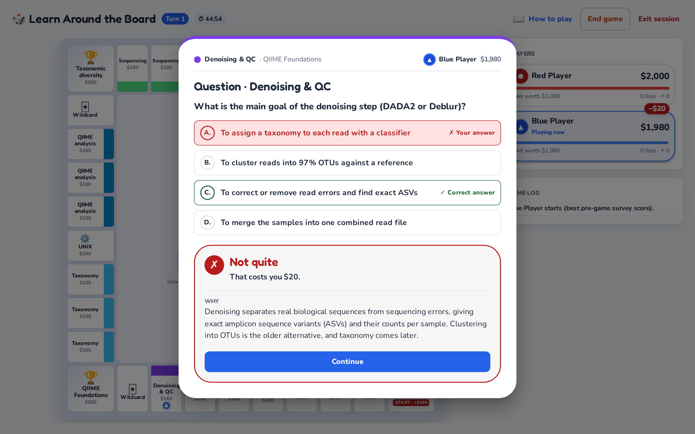
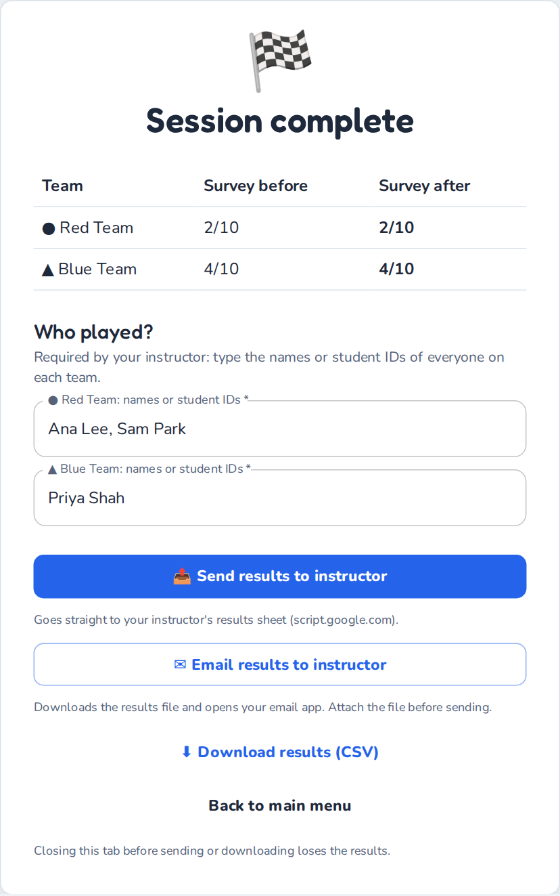

# How to play Learn Around the Board

**Student Guide** · *last updated October 2026*

> Learn Around the Board is a board game for reviewing your course. Players roll dice, answer your instructor's questions to buy tiles, charge each other rent and capture corner exams. Every answer is followed by an explanation, so a wrong answer is a chance to learn, not a failure. It takes about five minutes to learn the rules.
>
> The game runs in your web browser and you don't need an account. You can [read this guide online](https://hghezzi.github.io/Learn-Around-the-Board/guide/students.html) or [print it as a PDF](https://hghezzi.github.io/Learn-Around-the-Board/LAB_Student_Guide.pdf).

<!-- toc -->

## Before you start

You need:

- **A computer** (a laptop, a desktop or a tablet held sideways. A phone is too small to play comfortably; if it's all you have, turn it sideways and scroll the board) with an up-to-date browser such as Chrome, Edge, Firefox or Safari. Your instructor will tell you how many players share each computer. A computer can host 1 to 4 players.
- **Your instructor's questions.** This is either a **game link** or a **question file** (`.tsv`, or a protected `.lock` file).
- **The class password**, but only if your file is a `.lock` file.
- **Any image files** your instructor gave you. They are optional.

## Getting started

1. **Open the game.** Click your instructor's game link and the questions load by themselves. Without a link, go to <https://hghezzi.github.io/Learn-Around-the-Board/>, find **Use your instructor's questions**, click **Upload** and choose the file.
   - If the file is protected, a box asks for the **Class password**. Type it, then click **Unlock**. Passwords are case-sensitive.
   - If your instructor gave you images, click **Optional: upload images** and select all the image files at once (Ctrl+A on Windows, ⌘A on a Mac).
2. **Check that it loaded.** The page shows *Loaded … questions*. Click **Continue to game setup →**.
3. **Set up the game:**
   1. **How many players?** Choose *Solo* or *2*, *3* or *4 players* sharing this computer. Each player can be one student or a small group.
   2. **Session length.** Pick the time your instructor asks for, or *No timer*.
   3. **Choose a topic.** Click the topic, pick the module your instructor named under **Select module**, then click **Confirm selection**.
4. Click **Start game →**.
5. **Pre-game survey.** Each player answers in turn, and the screen shows whose turn it is (for example *Red Player · player 1 of 2*):
   - rate your confidence on each slider (0 to 10), then click **Continue to Questions**;
   - answer the 10 questions, then click **Next Player**. The last player clicks **Start Game**.

   Answer honestly, without help from the other players. The survey is your starting point, not a test, and the player with the best score goes first.

## Joining an online game

In an online game, your host's computer runs the board and you play from your own device.

1. Open the join link from your host, or go to <https://hghezzi.github.io/Learn-Around-the-Board/>, choose **Join an online game**, click **Enter a code** and type the room code from your host's screen.
2. **Who are you playing as?** Click **Play as …** next to a free player. A group can share one device.
3. Wait for the host to start. Then answer the **pre-game survey** on your device and click **Send my answers**.
4. On your turn, roll and answer on your device. On other players' turns you see every move, but you can't press anything.
5. At the end, type your names or student IDs and click **Send names to the host**. Your host hands in the results.

If the page reloads or the Wi-Fi drops, the game reconnects by itself and gives you your player back. If it can't join at all, check the code with your host; some networks block online games, so a phone hotspot may help.

## How to win

The game ends in one of two ways:

1. **Last player standing:** every other player has been eliminated by bankruptcy.
2. **Highest net worth:** when the timer runs out, or when your instructor asks you to click **End game**, the player with the highest net worth wins. Net worth is your cash plus what you paid for the tiles and upgrades you still own.

**Playing solo?** There are no rivals, so the rules change a little:

- Landing on a tile you own asks one of its questions. If you answer right, the bank pays you its rent; if you answer wrong, you pay $20.
- Your goal is to reach the net-worth goal shown on the board before time runs out (for example $5,000 in a 60-minute session). Capturing all four milestones is a bonus.
- There are no chaos tokens.

**Playing against the bot?** If you choose **Play against the bot** (Easy, Medium or Hard), you play the normal two-player rules against the computer, and you go first. On its turns, watch its question, its answer and the explanation; they are a free review. **Skip ahead** speeds up its turn. Only your own answers count in your results.

Starting cash depends on how many players there are: **$2,500** solo, **$2,000** each with 2 players, **$1,500** with 3 and **$1,250** with 4 (fewer players get more turns each, so they need more cash). Players take turns, and the **Players** panel on the right shows each player's cash and net worth.

## Your turn

When the game starts, a **How to play** pop-up sums up the rules. Click **Got it** to begin; the **How to play** button at the top of the board opens it again.

Click **Roll** (it shows your player's name). Your token moves around the board, and every time it passes **START** you collect a **$200 lap bonus**. Then the tile you land on decides what happens:

| You land on… | What happens |
| :--- | :--- |
| **An unowned tile** | Answer a question. If you're right, you may **Buy** the tile for its price or **Skip**. If you're wrong, you pay $20. |
| **A rival's tile** | You owe the owner rent, but you answer a question first. If you're right, you pay only **half** the rent. If you're wrong, you pay all of it. |
| **Your own tile** | Nothing happens. |
| **An unowned corner (milestone)** | You can take a 6-question exam on that side's theme. **Start exam** to try (you need $500), or **Decline**. If you get 5 of 6 right, you pay $500, own the corner and earn a ⚡ Chaos Token. A second wrong answer ends the exam, and you pay nothing. |
| **A rival's corner** | The fee is $250. Click **Accept challenge** to take the 6-question exam (if you get 5 of 6 right, you pay only half), or click **Pay full**. |
| **A Wildcard** | You draw a random event that pays or costs the amount shown, with a fun fact. |

The core tiles (the ones in the middle of each side) work like other tiles: you buy them for $200. Their rent grows with how many of the 4 core tiles the owner holds: $50 for each ($50 with one, up to $200 with all four).

### Answering questions

**If you play as a group, talk it over before you answer.** Clicking a multiple-choice option submits it straight away. The order of the options changes every time a question appears. Your instructor may also use these formats:

- **Select all that apply:** tick every correct option, then click **Submit answer**. You need exactly the right set.
- **Number:** type a number (a unit after it, such as "12 kg", is fine), then click **Submit answer**. For estimates, an answer close enough counts.
- **Put in order:** use the ↑ and ↓ buttons to arrange the steps, then click **Submit answer**.
- **Short answer:** type a word or short phrase. Capital letters and punctuation don't matter, and one small typo is forgiven in long words (8+ letters), but never in a number or a Roman numeral ("Type II" is not "Type I"). Short terms must be spelled exactly.

After every answer you see the correct answer and an explanation, so read it before you click **Continue**. The same ideas come back later in the game.

## Upgrades and Chaos Tokens

You can use these buttons during your turn, before you roll.

### Upgrades

Each side of the board has two **colour groups** of three tiles. When you own all three tiles of a colour, click **Upgrades** to add a star (⭐) to the whole group, up to four stars. Rent rises steeply with each star:

| Stars | none, group incomplete | none, full group | ⭐ | ⭐⭐ | ⭐⭐⭐ | ⭐⭐⭐⭐ |
| :--- | :---: | :---: | :---: | :---: | :---: | :---: |
| Rent on a $100 tile | $25 | $50 | $150 | $300 | $500 | $1,000 |
| Rent on a $160 tile | $40 | $80 | $240 | $480 | $800 | $1,600 |

Each of the first three stars costs one tile's price ($100 or $160) for the whole group, and the fourth star costs twice that.

### Chaos Tokens

You earn a ⚡ Chaos Token by capturing a corner milestone. Once all four corners are owned, you can also buy tokens for $500. To use one before you roll, click **Chaos tokens**, then **Challenge** a rival's tile:

- **Right answer:** you take the tile for half its price, which goes to its owner.
- **Wrong answer:** you pay a small fine to the bank.

The question comes from the tile's own topic. You spend the token either way, and using it ends your turn. A complete colour group (all three tiles, with or without stars) is protected and can't be challenged.

## Running out of money

If your cash drops below $0, the game helps you recover:

1. **Sell or downgrade.** You sell tiles or remove stars until you're back above $0. Each sale gives back half of what you paid.
2. **Rescue Quiz (once per game).** If selling everything still wouldn't cover the debt, you get a 3-question **Rescue Quiz**. If you get 2 or more right, your debt is cleared and you receive $500.
3. **Eliminated.** If you fail the Rescue Quiz, or go bankrupt a second time, you are out of the game, and your tiles return to the bank. Stay at the computer: you still take the post-game survey.

## Ending the game and handing in your results

**This part counts: your instructor needs your results file.**

1. When the timer ends, or when your instructor says so, click **End game** (top right), then **Yes, end the game**. The **Final Standings** show the winner. Then click **Continue to post-survey**.
   - Don't click **Exit session** unless you really want to quit, because it throws away this game and its results. Both buttons ask first: answer **No** to carry on playing.
2. **Post-game survey:** each player answers the same sliders and questions as before. The last player clicks **Finish Surveys**.
3. On the **Session complete** screen, type the **names or student IDs** of everyone who played as your player. If your instructor requires them, the buttons below stay grey until every player's box is filled.
4. Hand in your results the way your instructor asked:
   - **Send results to instructor:** sends them straight to your instructor. Wait until the button shows **Sent ✓**.
   - **Email results to instructor:** downloads the results file and opens your email app. **Attach the downloaded file** before you send the email.
   - **Download results (CSV):** saves the file (named `lab_results_….csv`) so you can upload it where your instructor asked, for example on your course page.

The buttons you see depend on how your instructor set up the game. If **Send** fails, use **Email** or **Download** instead.

## If something goes wrong

- **You refreshed or closed the page by accident.** Open the game again in the same browser: the start page offers **Resume your game?** Click **Resume**. A refresh in the middle of a turn takes you back to the start of that turn. Uploaded images have to be selected again. The saved game stays on this computer for 12 hours.
- **"That password didn't work."** Check capital letters and spaces, or ask your instructor.
- **A picture is missing.** The question still works without it. If you have the image files, go back to the start page and use **Optional: upload images**.
- **The board looks squashed.** Make the browser window wider, or zoom out (Ctrl and − on Windows, ⌘ and − on a Mac).
- **No internet?** After your first visit, the game works offline, but a game link needs the internet to load your instructor's questions, and online games need the internet throughout.

## Your privacy

The game runs in your browser. Your answers stay on this computer unless you send or hand in your results. The start page may ask whether you allow visit statistics (Google Analytics): choosing **No thanks** changes nothing in the game. To learn more, read the [privacy notice](https://hghezzi.github.io/Learn-Around-the-Board/privacy.html).

*Instructors: see the [Instructor Guide](instructor-guide.md).*
